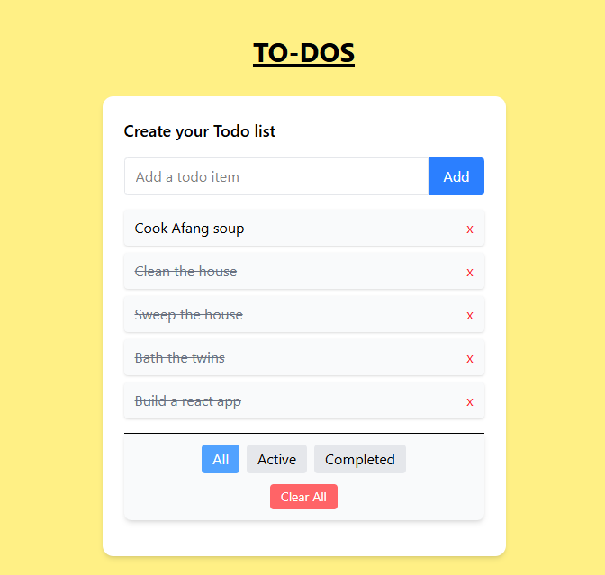

# 📝 Redux Todo App (v2)

A simple Todo List application built with **React**, **Redux Toolkit**,
and **Tailwind CSS**.  
You can add, toggle, delete, filter, and persist todos with local
storage.

---

## 🚀 Features

- ➕ Add todos  
- ✅ Mark todos as completed  
- ❌ Delete todos  
- 🔍 Filter by **All**, **Active**, or **Completed**  
- 💾 Persist todos using localStorage  
- 🧹 Clear all todos  

---

## 🛠️ Tech Stack

- [React](https://react.dev/)  
- [Redux Toolkit](https://redux-toolkit.js.org/)  
- [Tailwind CSS](https://tailwindcss.com/)

---

## 📦 Installation

Clone the repo and install dependencies:

```bash
git clone https://github.com/ifechiglory/redux-todo-app.git
cd redux-todo-app
npm install
```

---

## ▶️ Running Locally

Start the development server:

```bash
npm run dev
```

Then open <http://localhost:5173> in your browser.

---

## 📂 Project Structure

```bash
src/
 ├── app/             # Redux store setup
 ├── features/        # Redux slices
 │    └── todos/      # Todo slice
 ├── components/      # React components
 │    └── TodoList.jsx
 ├── App.jsx          # Root component
 └── main.jsx         # Entry point
```

---

## ✨ Demo



---

## 🔗 Versions

- [Todo App v1 (JavaScript)](https://github.com/ifechiglory/Todo-list)  
- ✅ You are currently viewing **Todo App v2 (React + Redux Toolkit)**

---

## 🤝 Contributing

Pull requests are welcome. For major changes, please open an issue first
to discuss what you'd like to change.

---

## 📜 License

This project is licensed under the MIT License.
